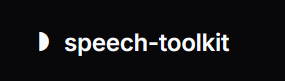
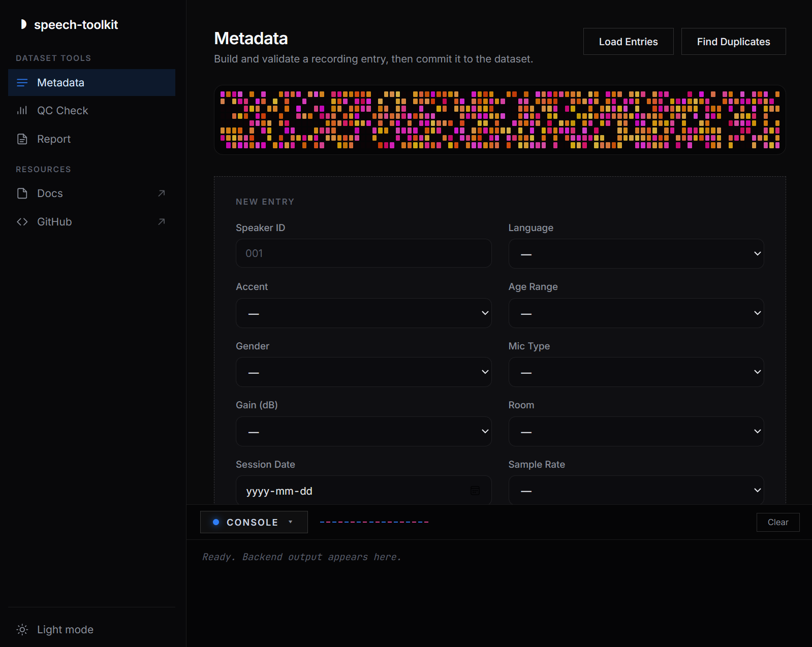
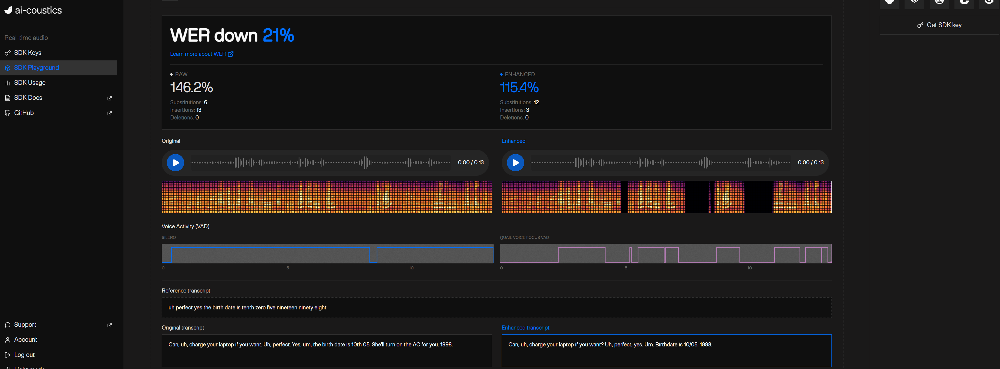

# Speech Recording Toolkit



> Toolkit developed to aid the process of tracking recording data and ensuring the correct format for training speech enhancement models.

---

## Why this exists

Recording over 1000 speakers consistently is tougher than it seems.
Little differences in volume, file format, or metadata can mess up the training data before the model gets to read it.
This toolkit aims to spot those problems early on, at the recording stage, where fixing them is the least troublesome.



---

## What's included

- **metadata_manager.py** — validates and stores recording metadata
- **audio_checker.py** — batch QC across a folder of recordings: format consistency, loudness, clipping, silence, and filename validation.
- **report_generator.py** — aggregates metadata and QC results into a summary report (JSON export)
- **app.py** — desktop UI wrapping all three modules (PyWebView)

> the **app.py** and ui was coded entirely with AI, while on the backend I wrote each definition by myself. 

---

## Product context



I tested ai|coustics' SDK Playground with a real speech sample. This made me understand why accuracy counts and I instantly thoguh of a tool to aid that process. The model is as good as the recordigns which trained it. The side by side view made that very clear. That's what this tool kit is for. I wanted to understand the problem so I can find a solution at the level of Python knoledge that I have. 

---

## How to run

```bash
pip install -r requirements.txt
python app.py
```

---

## Architecture

The backend logic (metadata_manager.py, audio_checker.py, report_generator.py) was written by me. The UI (app.py) was produced entirely with the help of AI.

---

## Built with

Python 3.14 · SQLite · pydub · PyWebView

---

## About

I am an audio student which has a passion for analysing sound: from sppech, to fft algorhythms, to emotion detection, to turning everyday objects and scenes into logical systems. Over the past 7 months I have taugh myself python from scratch (starting with AI assistance, then learning to write it properly myself over the last 4 months) and built tools alongside my other projects. I was an intern and now continue to colaborate now actively with msm-studios and Streamsoft in Berlin and I aspire to learn and actively explore machine learning for audio because that is the direction I plan to take my bachelor thesis.
